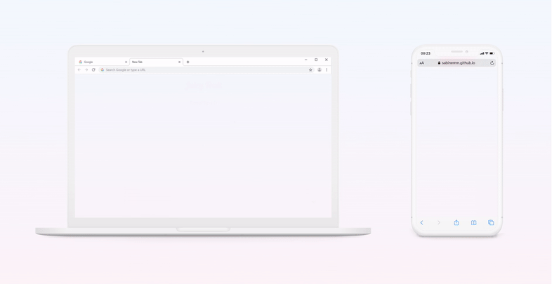

# JUICY FRUIT MEMORY GAME
#### Code Institute Interactive Front-end Web Development Project

<p align="center">
  
</p>

<p align="center"><a href="https://sabinemm.github.io/fruit-game/">
Play the game</a></p>

## Table of Contents

- [**About**](#About)
- [**Demo**](#Demo)
- [**UX**](#UX)
    - [User Stories](#User-Stories)
  - [Research](#Research)
  - [Wireframes](#Wireframes)
  - [Design](#Design)
- [**Features**](#Features)
    - [Functionality](#Functionality)
    - [Existing features](#Existing-features)
    - [Future features](#Future-features)
- [**Technologies used**](#Technologies-used)
- [**Testing**](#Testing)
    - [Manual testing](#Testing)
    - [Errors](#Errors)
- [**Code Notes**](#Code-Notes )
- [**Deployment**](#Deployment)
- [**Credits**](#Deployment)
    - [Code](#Code)
     - [Images](#Images)
     - [Audio](#Audio)
- [**Acknowledgements**](#Acknowledgements)
- [**Disclaimer**](#Disclaimer)
## About

The purpose of this project was to create and build a single page application - classical card matching game that that increases in complexity over the course of the game. It requires observation, concentration and a good memory to win. The game is also known as Concentration, Pelmanism, Shinkei-suijaku, Pexeso and Pairs.
You can read more about Concentration game visiting [Wikipedia](https://en.wikipedia.org/wiki/Concentration_(card_game)) page and the rules of a classic table card game [here](https://www.classicgamesandpuzzles.com/Memory.html).

I could choose between 3 different projects and chose to create a memory game because my goal is to learn more about animation and logic. I learned a lot during this project e.g. how to use classes and constructors. Also, I realised my weak areas that require improvement e.g. understanding scope and algorithms. 

I was initally tempted to create a Snakes and Ladders game. I had downloaded one version of it on my Ipad and found it to be poorly made. As it would be too difficult for me to create at this point and found a great tutorial by [Web Dev Simplified](https://www.youtube.com/channel/UCFbNIlppjAuEX4znoulh0Cw) for memory game and decided to go with it.

Game name idea simply comes from the images I used for the project. 

I would improve a lot of things if I had more time. For example - count the score throughout the game and create a high score board, animate everything in a more appealing way, refine the design, make the game beautifully responsive on all devices.

## Demo

<p align="center">
  
</p>

<p align="center">
<a href="https://res.cloudinary.com/www-madine-se/video/upload/v1587425336/fruit_game/demo-video_jz6isg.mov">Demo video backup</a>
</p>

## UX
### User Stories

* I want to play a game to improve my memory with simple and straightforward use.
* I want to game to be presented in visually appealing and non-disctracting way.
* I want to be presented with an game start window to be able to start the game on-click.
* I want to hear a sound when clicking on a card to indicate card flipping around.
* I want the background sound to be muted before I start the game.
* I want to be able to turn the background sound on and off.
* I want to play through levels increasing in difficulty.
* I want to be able to play the game on different devices.
* I want to hear a sound that indicates that I have found a card match.
* I want to hear and see that I have completed a level.
* I want to be able to click on the screen to start playing the next level, in case I want to take a break.
* I want to be notified of when I win the game after completing a set number of levels.
* I want the ability to restart the game after winning or failing.

### Research

To understand the game, I researched existing versions of the game. This gave me a clear idea what functionality and design my version of the game will have.

Most versions had square or rectangular cards. Many versions of the game had extremely colorful clashing patterns that distract the player from memorizing the cards. This is my reasoning why I chose the particular design.

### Wireframes
* Starting with a desktop first approach I created a very basic wireframe. [Wireframe and notes](https://res.cloudinary.com/www-madine-se/image/upload/v1585001794/fruit_game/Untitled_Artwork_2_zccka0.jpg) from first mentor call. 

* Interactive Adobe XD [prototype](https://xd.adobe.com/spec/7b9cb5c9-c6f7-4647-7e5f-4a64a4b353b3-0dad/) 
* [Screenshot](https://res.cloudinary.com/www-madine-se/image/upload/v1587419045/fruit_game/Screenshot_2020-04-20_at_23.43.23_qnslkb.png) - page and overlays in same file for simplicity

* [Start game](https://res.cloudinary.com/www-madine-se/image/upload/v1587419325/fruit_game/Start_game_overlay_den4to.png)
* [Level 1](https://res.cloudinary.com/www-madine-se/image/upload/v1587419325/fruit_game/level_1_rxvm5e.png)
* [Level Up](https://res.cloudinary.com/www-madine-se/image/upload/v1587419325/fruit_game/Levelup_gll25d.png)
* [Level 2](https://res.cloudinary.com/www-madine-se/image/upload/v1587419325/fruit_game/level_2_s8r5nz.png)
* [Victory / Game over](https://res.cloudinary.com/www-madine-se/image/upload/v1587419325/fruit_game/game_over_bv9vpv.png)

There are differences between my original wireframe and the actual page because changes happened during development process. I did not find the need to create any more detailed mockups  because the design is so simple and I already had seen how my cards look [together](https://res.cloudinary.com/www-madine-se/image/upload/v1585001211/fruit_game/Screenshot_2020-03-23_at_21.49.36_gvqbya.png). 

### Design
The design of this page is clean and fresh. I used neutral colors for the background and the back of the cards so the user can concentrate on the front of the cards which have different pastel backgrounds and the fruits are in rich colors. 

To create the cards I created a Photoshop file with numerous artboards and imported the back of the card and the individual fruit vectors. Then added pastel backgrounds in different tones. The screenshot of initial card design can be found [here](https://res.cloudinary.com/www-madine-se/image/upload/v1585001211/fruit_game/Screenshot_2020-03-23_at_21.49.36_gvqbya.png).

I adjusted the brightness of [back](https://res.cloudinary.com/www-madine-se/image/upload/v1587330036/fruit_game/cards/card-back3_vy5epc.jpg) of the cards and created [game title](https://res.cloudinary.com/www-madine-se/image/upload/v1587327312/fruit_game/JuicyCombo_kn64cx.png) with fruit and transparent background later on in the project using AI and PS.

During the development process I tweaked colors and card brightness, fonts, font colors and sizes to be more visually pleasing. With time I would tweak more small details, like colors and mute button location in relation to overlays.

I got rather lucky finding the perfect free fruit vectors. It took only a few minutes of googling. I'm always very picky about the images I choose so finding them so fast was surprising.

## Features
### Functionality

* Game starts with a "Click to start" overlay
* The cards sligthy increase in size when hovered over
* Pointer changes to hand when hovered over the cards and overlays
* Cards have different images on front and the same pattern on the back
* Cards flip with the according sound for realism
* Upbeat sound for moving on to the next level
* "Woop! Level Up!" and "Click to play next" overlay appears between levels
* Time countdown - user has 60 seconds to pass each level
* Flips are counted throughout the game
* Several levels
* "Victory" overlay appears when the game is finished with an option to click to restart 
* "Game Over" overlay appears when time runs out.
* The page refreshes when clicked on Game Over or Victory overlay.

###  Existing features

* **Start Game overlay** with Juicy Fruit logo
* **On and off button** for background music
* **Cards**
* **Timer**
* **Flip Counter**
* **Level Up overlay**
* **Victory overlay**
* **Game Over overlay**
* **Backdrop blur** behind overlays for aesthetic purposes

###  Future features

- [ ] **More mobile friendly** (cards strething accordingly across different screens)
- [ ] **Pause game** button.
- [ ] **Pause audio** when page is inactive.
- [ ] **Popup** "Are you sure you want to give up?" if trying to close the page mid game.
- [ ] **Leaderboard**  This would require entering a name before starting a game and then storing the game score in a database.

## Technologies used
Below are a list of the programming languages, technologies, frameworks and resources used for this website.

* **HTML5**
* **CSS3**
* **Vanilla JS**
* **Visual Studio Code** development environment
    - Live Server Extension
    - Color Picker Extension
    - Markdown Preview Extension
* **Git** for version control
* **Github** to store project
* **Github pages** to deploy project
* **Markdown** (README.md file)
* **[Google Fonts](https://fonts.google.com)**
* **Google Chrome** developer tools
* **Firefox** Inspector
* **Safari** Web Inspector 
* **[Procreate](https://procreate.art)** on iPad (mockup drawing)
* **Adobe Photoshop CC** to create cards
* **Adobe Illustrator CC** importing & editing fruit vectors
* **Adobe XD** to create mockup and prototype
* **[Cloudinary](https://cloudinary.com/)** to store all images
* **[Favicon.io](https://favicon.io/favicon-converter/)** to convert favicon.ico
* **[Material.io](https://material.io/resources/icons/?style=baseline)** Mute/unmute icons
* **Adobe Premiere** to edit gameplay video
* **[EZGIF](https://ezgif.com/video-to-gif)** to convert video to GIF for ReadMe file
* **[Fisher–Yates shuffle](https://en.wikipedia.org/wiki/Fisher–Yates_shuffle)** to shuffle the cards

## Testing
* [HTML validator](https://validator.w3.org/#validate_by_input)
* [CSS validator](https://jigsaw.w3.org/css-validator/#validate_by_input)
* [JsHint](https://jshint.com)
* Testing [checklist](https://geteasyqa.com/qa/test-website/)

I used DevTool breakpoints and watches to debug my JS errors in Safari and Chrome. I used a lot of ```console.log()``` to see if my code us running correctly.

I conducted testing on several platforms and browsers to make sure that game worked properly and looked correct everywhere. I asked friends and peers for their feedback and any errors they encountered.

Devices and platforms used for testing:

* Iphone X 
    - Safari
    - Chrome
    - Brave
* Ipad Pro 12.9" 2018
    - Safari 
    - Chrome
* MacBook Pro 13" MacOS Catalina
    - Safari 
    - Chrome
    - Firefox
* MacBook Pro 13" Windows 10
    - Chrome
    - Firefox
    - Microsoft Edge
* OnePlus 5T
    - Firefox
    - Chrome
* Windows 7
    - Chrome
    - Firefox
* Huawei P20 Pro
    - Chrome

### Manual testing
1. Clicking on overlay over the whole window area.
2. Turning all cards, clicking on all cards fast.
3. Turning background audio on and off by clicking mute button.
4. Letting timer run out to check if Game Over overlay appears.
5. Playing game until Victory overlay appears.
6. Clicking on  mute button to see if it toggles correctly.
7. Clicking on mute button to hear if it turns the sound on and off.
8. Checking there are no grammar and spelling mistakes
9. Instructions are clear.
10. Testing if all content is visible on different size screens.

I had planned to use Jasmine  for automated testing but due to time constraints I was not able to. Yet.

### Errors
Current errors:

1. ***NOT YET FIXED*** Backdrop blur does appear on some devices, even though i've added webkit

Resolved errors:
1. Deployed website on Github pages opened on Safari sometimes lets match not actually matching cards. Had missed a line of code
2. Reaching level two, cards duplicate function called twice.
3. When failing with time running out, game moves on to the next level. 
4. Too many papayas on level 2. LocalStorage issue
5. Duplicated on level 3 from level 2. LocalStorage issue
6. Levels localStorage does not increment properly on Safari. I found a possible [solution](https://github.com/marcuswestin/store.js/) on [Reddit](https://www.reddit.com/r/webdev/comments/7dn7dc/problems_with_localstorage_on_safari/). Fixed by just storing the level in a variable.
7. On some browsers/devices the game levels do not function properly. Level Up overlay shows up, but no cards are added to the deck. I parsed the local storage items, because that was the issue with Firefox but the problem still exists on mobile Chrome. Fixed by storing the level in a variable.
8. The first error I encountered was with Safari (on all devices) while turning cards. [Click here to see video](https://res.cloudinary.com/www-madine-se/video/upload/v1585779094/fruit_game/safari-error-fruit-game_am8yt1.mov). During the animation of card turning it glitches and half of the other side is visible during animation. I added -webkit- etc to transform styles but it did not solve the issue. By googling I found that many other people have run into this issue. Fixed by adding ```-webkit-backface-visibility: hidden;```
## Code Notes 

I acknowledge that inline onclick events are not best practice, and should be handled in script file, but I found it less time consuming at the moment and might correct at a later point and will not use them in the same way in future projects.

This project is not supported on Internet Explorer because of JavaScript ES6 syntax use.

CSS validator shows some warnings about alphabetical order and non-standard vendor prefixes.

It is hard to finish the game on smaller screens due to necesarry scrolling with current styling. I might adress this issue at a later date.


## Deployment
The project was made by creating and new repository in Github, copying [web url](https://github.com/sabinemm/fruit-game.git) and cloned by pasting the link in Visual Studio Code built-in Git control. Git was used for version control and pushed to a repository hosted on [Github pages](https://sabinemm.github.io/fruit-game/)

### How to deploy code locally:

1. Go to my GitHub [repository](https://github.com/sabinemm/fruit-game.git) 

2.  Click on 'Clone or download' under the repository name.

3. Copy the clone URL for the repository in the 'Clone with HTTPs section'.

4. Open terminal in your local IDE.

5. Change the current working directory to the location where you want the cloned directory to be made.

6. Type  ```git clone``` and paste copied repository link.

Or paste this into your console:

```
git clone https://github.com/sabinemm/fruit-game.git
```

7. Press Enter to complete

## Credits
### Code
* HTML and CSS part of the [tutorial](https://www.youtube.com/watch?v=28VfzEiJgy4) 
* Javascript [tutorial](https://www.youtube.com/watch?v=3uuQ3g92oPQ) 
* [StackOverflow](https://stackoverflow.com/questions/60885320/inserts-a-div-and-a-link-into-the-div-twice-and-does-this-with-several-links-js)
* [Maranatha Ilesanmi](https://github.com/mbilesanmi) helping me with setting up local storage for levels 
* My friend Rūta with helping me to put cards in the constructor 
* [OnClick refresh](https://stackoverflow.com/questions/29884654/button-that-refreshes-the-page-on-click)
* Several CI student ReadMe files as examples for my project writeup. (First example was no longer available. Here is the [second](https://github.com/hebs87/simon-milestone-project-two/blob/master/README.md).)

### Images
* [Fruit composition](https://www.freepik.com/free-vector/tropical-fruits-4-colorful-compositions-set_3791460.htm#page=2&query=fruits++mango&position=34)
* [Back of the card pattern](https://www.freepik.com/free-vector/hand-drawn-fruit-mobile-pattern_3069263.htm#page=1&query=fruits&position=38)
* [Individual fruits](https://www.freepik.com/free-vector/tropical-fruits-retro-cartoon-icons-set_3791458.htm#page=2&query=fruits++mango&position=15)
* [Phone and laptop](https://store.ramotion.com/product/sketch-mockups?#demo) for gif

### Audio
* [Card flip](http://www.orangefreesounds.com/card-flip-sound-effect/)
* [Matched](https://www.zapsplat.com/music/game-sound-synthesized-bright-pluck-good-for-success-award-or-achievement-1/)
* [Level up](https://www.zapsplat.com/music/advance-award-or-other-positive-game-tone-plucked-nylon-style-sound-1//)
* [Victory](https://www.zapsplat.com/music/cartoon-success-fanfare/)
* [Game over](https://www.zapsplat.com/music/game-sound-basic-digital-retro-incorrect-wrong-error-negative-tone-10/)
* [Background audio](https://www.zapsplat.com/music/forest-environment-ambience-clearing-spring-summer-birds/)

## Acknowledgements

Appreciating my friends Rūta and Agris teaching me how to find and fix errors and giving me hints how to solve problems.

Thanks to my cat for listening to me during [Rubber Duck Debugging](https://rubberduckdebugging.com).

A thanks to my mentor [Maranatha Ilesanmi](https://github.com/mbilesanmi) for helping and guiding me through the process of developing this game. 

### Disclaimer

This project is for educational purposes only.


[Back to top ↑](#JUICY-FRUIT-MEMORY-GAME)